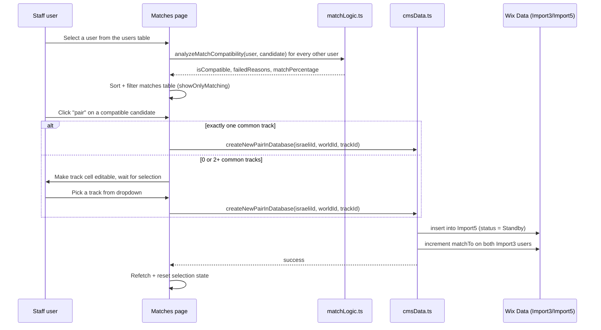

# Pair Chavrutas — Codebase Guide

This document explains what the app does, how it is structured, and — most
importantly — the **role and logic of every page, modal, and shared module**.
It is meant to get a new developer productive without having to reverse
engineer the code from scratch.

> For CMS field quirks (inconsistent casing, legacy tracks), see
> [/memories/repo/cms-schema.md] notes referenced throughout this doc, and the
> "Known Quirks" section at the end.

---

## 1. What this app is

**Pair Chavrutas** is a **Wix Dashboard App** (built with `@wix/dashboard` and
`@wix/data` only — no `$w()` selectors, no Velo `onReady()`, no site-facing
Wix APIs). It runs inside the Wix Business Manager as a set of dashboard
pages and modals, and lets Shalhevet staff:

1. Manage **Users** (people who signed up to learn/teach Torah in pairs).
2. Manually **match** an Israeli user with a Diaspora ("world") user into a
   **Chavruta** (a learning pair), based on compatibility rules.
3. Track a Chavruta through its lifecycle: **pending → active → learning →
   archived (deleted)**.
4. Send pairing notification emails once a match is activated.

The two "sides" of every pair are always one Israeli user and one
non-Israeli ("world"/diaspora) user — this Israeli/non-Israeli split is a
recurring assumption throughout the matching logic and UI (see
[src/data/matchLogic.ts](../src/data/matchLogic.ts)).

---

## 2. Tech stack & project layout

- **React** function components + hooks (no class components).
- **@wix/design-system** for all UI primitives (`Page`, `Box`, `Text`,
  `Dropdown`, `CustomModalLayout`, etc.).
- **@wix/dashboard** for navigation, toasts, modal open/close, and reading
  modal params (`dashboard.observeState`).
- **@wix/data** (`items` from `@wix/data`) for all CMS reads/writes — this is
  the *only* persistence layer, there is no custom backend API beyond a Wix
  HTTP function used for email sending.
- **lucide-react** for icons, **consola** for structured console logging in
  data modules, and a small custom `logger` util for React-facing code.

```
src/
  dashboard/
    pages/            → one folder per full-screen dashboard page
    modals/            → one folder per modal (opened via dashboard.openModal)
  components/          → shared, reusable presentational components
  hooks/                → shared stateful logic (pagination, search, filters, modal params)
  data/                  → all CMS access + domain/matching business logic
  constants/            → enums & static lookup tables (status, tracks, modal ids)
  types/                 → shared TypeScript types for the whole app
  utils/                 → logger, error classes, table-row formatters
  users/page.tsx         → legacy/unused standalone page (see "Known Quirks")
```

Each dashboard page and modal is registered via a co-located `page.json` /
`modal.json` file (Wix CLI convention) that declares its Wix-assigned id,
title, and (for modals) width/height. The page/modal `.tsx` file is the
actual React entry point rendered inside that shell.

---

## 3. Core domain model

Defined in [src/types/index.ts](../src/types/index.ts).

### Collections (`COLLECTION_NAMES`)
| Constant | CMS collection | Holds |
|---|---|---|
| `USERS` | `Import3` | Individual users (Israeli + world) |
| `CHAVRUTAS` | `Import5` | Pair records linking two users |
| `TRACKS` | `tracks` | Learning track lookup (Talmud, Tanya, etc.) |

### `User`
A person who registered to learn. Key fields:
- `country` — used everywhere to decide "Israeli" vs "world" role.
- `skillLevel` / `desiredSkillLevel`, `englishLevel` / `desiredEnglishLevel` —
  **which field is the "actual" vs "desired" value depends on country**
  (see §5.3).
- `prefTracks` — array of track ids (or legacy numeric indices) the user is
  willing to learn.
- `sunday`..`thursday` — either a `LearningTime` boolean object
  (`{morning, noon, evening, lateNight}`) or a legacy `string[]` of slot
  names — both formats appear in the CMS and must be normalized before use.
- `matchTo` — current number of active/pending chavrutas the user has.
- `prefNumberOfMatches` — how many chavrutas the user wants; used together
  with `matchTo` to compute whether they still need matching.

### `Chavruta`
A pairing between one Israeli `User` and one world `User`:
- `newFromIsraelId` / `newFromWorldId` — reference fields, either a bare
  `{_id}` or fully populated `User` (populated when queried `.include(...)`).
- `status` — `ChavrutaStatus` enum: `Standby(1)` (pending), `Active(2)`,
  `Learning(3)`.
- `isDeleted` / `IsDeleted`, `dateOfCreate` / `DateOfCreate` — **inconsistent
  field casing exists in the live CMS data**; always read both and prefer
  helper functions (`isChavrutaDeleted`, `getChavrutaCreationTimestamp` in
  `cmsData.ts`) rather than a single field.

### Enums (`constants/status.ts`, `constants/tracks.ts`, `types/index.ts`)
- `PairStatus` / `ChavrutaStatus` — Default, Standby, Active, Learning.
- `PreferredTracks` + `PreferredTracksInfo` — the fixed set of learning
  tracks, each mapped to a stable CMS track `id` (used for filtering/joining
  against the `tracks` collection) and an English label `trackEn`.
- `EnglishLevel`, `SkillLevel`, `LearningStyle` — indexed enums whose numeric
  value is stored in the CMS and turned into human labels by
  `data/formatters.ts`.

---

## 4. Data layer (`src/data/`)

### `cmsData.ts` — all CRUD against Wix Data
This is the single source of truth for reading/writing `Import3` (users),
`Import5` (chavrutas), and `tracks`. Organized by domain:

- **User operations**: `fetchCMSData` (active users), `fetchArchivedUsers`,
  `fetchMatchData` (subset of fields needed for the matching algorithm),
  `getUserById` / `fetchUserById` (deprecated alias), `fetchUserContact`,
  `saveUserChanges`, `updateUserBase` (generic read-modify-write helper),
  `updateMultipleUsers` (batch, used when both sides of a pair change),
  `archiveUser` / `unarchiveUser` (soft archive via `isInArchive`),
  `deleteUser` (hard delete — warns if the user still has active chavrutas).
- **Chavruta operations**: `fetchChavrutasFromCMS` (all non-deleted, newest
  first — de-duped/sorted client-side because of the casing issue),
  `fetchPendingChavrutasFromCMS` (status = Standby only),
  `getChavrutaById`, `updateChavrutaBase` (generic update helper),
  `updateChavrutaStatus`, `updateChavrutaTrack`, `updateChavrutaNote`,
  `createNewPairInDatabase` (inserts the chavruta **and** increments
  `matchTo` on both users), `activatePairInDatabase` (Standby → Active,
  stamps `dateOfActivation`), `deletePairFromDatabase` (soft delete only),
  `deleteChavrutaAndUpdateUsers` (soft delete **and** decrements `matchTo`
  on both participants — this is the one actually used by the UI's
  delete/discard flows).
- **Track operations**: `getTracks` prefers the bundled
  [src/data/tracks.json](../src/data/tracks.json) static file and only falls
  back to `fetchTracks()` (live CMS query) if that file is empty — this
  avoids a network round trip for a list that rarely changes.
- **Email operations**: `sendPairingEmail` builds contact/track info for both
  users and delegates the actual send to `sendEmails.ts`.

All functions log via `consola` and rethrow on error (callers are
responsible for catching and showing a toast).

### `matchLogic.ts` — compatibility & scoring engine
Pure functions, no CMS access, so they're easy to unit test. Central entry
points:

- `checkUserCompatibility(sourceUser, potentialPair)` — boolean gate used
  historically; runs, in order: country, gender, English level, shared
  track, overlapping learning time, and the pair's matching limit.
- `analyzeMatchCompatibility(...)` — same checks but returns **all** failed
  reasons (`MatchFailureReason[]`) plus the first one, so the UI can explain
  *why* two users don't match (used by the Matches page "First Blocker"
  column and the "why is nobody compatible" insight banner).
- Individual predicates, each with a short domain rule baked in:
  - `checkCountryCompatibility` — exactly one side must be `'Israel'`.
  - `checkGenderCompatibility` — both sides' `prefGender` must be satisfied
    by the other side's `gender` (handles legacy array-wrapped values).
  - `checkLearningSkillCompatibility` — Israeli's `desiredSkillLevel` is
    compared against the world user's `skillLevel` (the reverse comparison
    is commented out in `checkUserCompatibility`, i.e. currently **not**
    enforced in the main gate — only used directly by the match popup).
  - `checkEnglishLevelCompatibility` — mirrors the skill-level pattern:
    "desired" is compared against the other side's "actual" level, and the
    definition of desired vs actual flips based on which side is Israeli.
  - `checkTrackCompatibility` — at least one shared id in `prefTracks`.
  - `checkLearningTimeCompatibility` — the more involved one:
    1. `parseUtcOffset` turns a UTC offset string (`"+02:00"`) or number into
       hours.
    2. `convertTimeSlotesToHours` expands each user's day/slot booleans (or
       legacy string arrays) into concrete hour numbers using `TIME_SLOTS`.
    3. `convertHoursToTargetTimezone` shifts one user's hours into the
       other's timezone, rolling over into adjacent days if needed.
    4. `findOverlappingHours` intersects the two hour sets per day.
    5. Compatible if any day has an overlap.
  - `checkMatchingLimitCompatibility` — the potential pair must not have
    already reached `prefNumberOfMatches`.
- `calculateMatchPercentage` — used by the Matches page to rank/sort
  candidates once they've passed the compatibility gate (weights the same
  signals used above into a 0–100 score).

### `formatters.ts` — CMS ⇄ UI shape conversion
- `formatUserData(rawUser)` — turns a raw CMS user record into
  `ChavrutaCardProps` (grouped label/value pairs, learning-time grid,
  open questions) consumed by `UserCard` and `MatchPopup`. Handles the
  Israeli-vs-world conditional labeling (e.g. "Desired Learning Skill" vs
  "Learning Skill") and legacy array-based day/slot data via
  `checkTimeSlot`.
- `resolveIndexedValue` — the shared helper that turns a stored numeric
  index (or already-stringified value) into a human label from a lookup
  array (`EnglishLevels`, `SkillLevels`, `LearningStyles`), defaulting to
  `'not specified'`.
- `initializeFormData` / `initializeFormLearningTimes` /
  `convertLearningTimesToServerFormat` / `reverseFormatUserData` /
  `prepareDataForSaving` — the inverse direction, used by `EditUserForm` to
  seed editable form state from a CMS user and to convert edited form state
  back into the shape `saveUserChanges` expects.

### `sendEmails.ts`
Thin wrapper that creates a Wix SDK client (`dashboard.host()` +
`dashboard.auth()`) and POSTs to a Wix HTTP Function (`newSendEmail`) with
the recipient's contact info, an `emailId`, and template `variables`. Used
only from `sendPairingEmail` in `cmsData.ts`.

---

## 5. Dashboard pages (`src/dashboard/pages/`)

Each page is a self-contained `DashboardPage` component that: fetches its
own data on mount, keeps a local "row" shape for the table, and wires up
`GenericTable` + modals for interactions. None of them share state — each
page re-fetches from CMS independently.

### 5.1 `pages/page.tsx` — default/placeholder page
The scaffold page generated by the Wix CLI template. Shows a toast demo and
a link to Wix docs. Not part of the real product flow; safe to ignore or
repurpose as a landing page.

### 5.2 `pages/users/page.tsx` — **Users**
Lists all users (`Import3`), with an Active/Archived toggle.

- **Data**: `fetchCMSData()` when `showArchived` is false, else
  `fetchArchivedUsers()`; both refetch whenever the toggle changes.
  Raw users are converted to `UserRow`s via
  `utils/userFormatters.ts#formatUsersForTable` (computes `hasChavruta`
  from `matchTo`/`prefNumberOfMatches`, formats the registration date, and
  derives a `registrationYear` used for the year filter).
- **Filtering** (`useTableFilters`): registration year, location
  (Israel / not Israel), has-chavruta (Yes/No) — all applied client-side in
  a `useMemo` over the already-fetched rows, then combined with the
  debounced search term (`useTableSearch`) and finally paginated
  (`useTablePagination`).
- **Row actions** (icon columns wired to `MODAL_IDS`):
  - `details` / `contactDetails` / `edit` → opens the **User Details modal**
    (`new-modal`) in view / contact / edit mode respectively (same modal,
    different params).
  - `notes` → opens the generic **Notes modal**.
  - `archive` → toggles `isInArchive` via `archiveUser`/`unarchiveUser`
    after a `window.confirm`, then refetches.
  - `delete` → **hard deletes** the user via `deleteUser` after a strongly
    worded confirmation (irreversible).
- Clicking a row (not on an action icon) opens the details modal too.

### 5.3 `pages/chavrutas-page/page.tsx` — **Chavrutas**
The master list of all pairs (`Import5`), split into `activeChavrutas` vs
`archivedChavrutas` in local state (populated together from one
`fetchChavrutasFromCMS()` call, then bucketed by `isArchivedChavruta`).

- **Toggle** switches which bucket is displayed/filtered/paginated; the
  Active/Archived split affects both which columns are shown and which
  columns are editable.
- **Filters**: year (derived from `matchDate`), track, status, plus search
  by either participant's name — all applied in one `useMemo`.
- **Inline-editable columns** (only when not archived): `track` and
  `status` render as dropdowns (via `TableColumn.editable`) whose
  `onSelect` calls `handleTrackChange` / `handleStatusChange`, which persist
  through `updateChavrutaBase` and optimistically patch local state.
- **Row actions**:
  - `details` (eye icon) → opens **Chavruta Details modal**, passing the
    already-fetched `participantData` (so the modal doesn't need its own
    fetch) plus the chavruta id and current note.
  - `mail` → placeholder, not implemented yet.
  - `delete` → opens the **Delete Pair modal**, which — on confirmation —
    calls back into this page's `handleDeletePair`. That handler
    optimistically moves the row from active → archived locally, then
    calls `deleteChavrutaAndUpdateUsers` (soft delete + decrement both
    users' `matchTo`), rolling back the optimistic UI state on failure.
  - `notes` (archived view only) → opens the Notes modal in read-only mode
    to show the stored `deleteReason`.
- Uses local helper functions `getParticipantName`, `getChavrutaCreationDate`,
  `isArchivedChavruta` to paper over the CMS's inconsistent field casing and
  the fact that participant refs may or may not be populated.

### 5.4 `pages/matches/page.tsx` — **Matches** (the matching workbench)
The most complex page — two linked tables:

1. **Left/first table (`userColumns`)** — all active users
   (`fetchMatchData()`), defaulting to only those who still need a match
   (`havrutaFound = matchTo >= prefNumberOfMatches` filters them out unless
   "show all" is toggled on).
2. **Right/second table (`matchColumns`)** — populated only after a user is
   selected from the first table (`handleUserSelect`). For the selected
   user, it computes compatibility against **every other user** using
   `analyzeMatchCompatibility` + `calculateMatchPercentage` from
   `matchLogic.ts`, storing `isCompatible`, `firstFailedReason`,
   `matchPercentage`, and `commonTracks` per candidate. By default only
   compatible matches are shown (`showOnlyMatching`), sorted by percentage
   descending.
3. Before comparing, raw CMS user shapes are normalized:
   `normalizeTrackIds` (string|number → number[]) and
   `normalizeLearningTime` (legacy string[] slot names → `LearningTime`
   boolean object) — this page keeps its own copies of these normalizers
   (duplicated from the CMS data layer) because the local `User` interface
   here still allows the legacy shapes.
4. `noMatchInsight` — when the selected user has zero compatible candidates,
   aggregates `firstFailedReason` counts across all candidates to show
   "most people failed because of X" guidance.
5. **Pairing flow** (`handlePairClick` → `handlePairWithTrack`):
   - If the candidate has exactly one common track, pairs immediately.
   - If zero or multiple common tracks, makes that row's track cell
     editable (dropdown limited to common tracks, or all tracks if none are
     common) and waits for the user to pick one.
   - `handlePairWithTrack` decides which side is "Israeli" (source) vs
     "world" (target) by country before calling
     `createNewPairInDatabase(sourceId, targetId, trackId)`, then refetches
     everything and clears the editable/track-selection state.
   - Clicking a match row (not the pair action) opens the **Matches modal**
     for a detailed side-by-side compatibility breakdown.

### 5.5 `pages/pending-matches/page.tsx` — **Pending Matches**
Simpler page for chavrutas still in `Standby` status
(`fetchPendingChavrutasFromCMS`). Single table, two row actions:
- `activate` → opens the **Activate Pair modal**, passing both participants'
  ids/names, track info, and an `onActivated` callback (which is just
  `fetchInitialData` from this page, so the list refreshes after the modal
  does its work).
- `discard` → confirms, optimistically removes the row, then calls
  `deleteChavrutaAndUpdateUsers` (same soft-delete + decrement flow as the
  Chavrutas page), reverting via a full refetch if the call fails.

---

## 6. Modals (`src/dashboard/modals/`)

Modals are opened with `dashboard.openModal({ modalId, params })` from a
page, and read those params back via the shared
[useDashboardModalParams](../src/hooks/useDashboardModalParams.ts) hook
(wraps `dashboard.observeState`, so params can arrive asynchronously — every
modal guards against a `null` params during the first render).

| Modal folder | `MODAL_IDS` key | Opened from | Purpose |
|---|---|---|---|
| `new-modal` | `USER_DETAILS` | Users page (details/contact/edit), Matches page (details) | One modal, three modes via params: view (`UserCard`), edit (`EditUserForm` + save), contact (`ContactPopup`). Edit mode formats form state back to CMS shape via `formatters.ts` and calls `saveUserChanges`. |
| `chavruta-details` | `CHAVRUTA_DETAILS` | Chavrutas page (details icon) | Shows both participants' contact info (`ChavrutaDetails`) and an editable note that persists via `updateChavrutaBase`. |
| `notes` | `NOTES` | Users page (notes icon), Chavrutas page (archived notes/read-only) | Generic textarea note editor (`NotesSection`); the actual save behavior (what field it writes to) is fully delegated to the caller's `onSave` param, making this a reusable "note editor" shell. |
| `activate-pair` | `ACTIVATE_PAIR` | Pending Matches page | Two-step flow: (1) confirm the pairing, (2) choose whether to send a notification email. Calls `activatePairInDatabase` then optionally `sendPairingEmail`, then the caller's `onActivated` callback. |
| `matches-modal` | `MATCHES` | Matches page (clicking a candidate row) | Fetches both users fresh by id, determines which is Israeli vs diaspora for display, and renders `MatchPopup` with a full compatibility breakdown. |
| `delete-pair-modal` | `DELETE_PAIR` | Chavrutas page (delete icon) | Requires a non-empty delete reason (validated client-side) before invoking the caller-supplied `onDelete(pairId, reason)`. |
| `to-archive` | `TO_ARCHIVE` | *(currently unused — no page opens this modal id today; kept for the archive flow)* | Confirms and archives a user via `archiveUser`. |
| `choose-track` | `CHOOSE_TRACK` | *(only `modal.json` exists — no `.tsx` implementation yet)* | Reserved id for a future "choose track" modal; the Matches page currently handles track selection inline instead. |

All modals wrap content in `WixDesignSystemProvider` + `CustomModalLayout`
individually (there's no shared modal shell component), and every
`primaryButtonOnClick`/`secondaryButtonOnClick` is responsible for calling
`dashboard.closeModal()` itself.

---

## 7. Shared components (`src/components/`)

- **`GenericTable.tsx`** — the one table implementation used by every page.
  Takes generic `columns`/`data` (typed via `types/table.types.ts`), and
  handles: search input, pagination controls, row click, per-cell click
  handlers (`column.onClick`), inline-editable cells (`column.editable`,
  either a static config or a function of the row — see the Matches page's
  track column for the function form), and a small icon lookup (`ICON_MAP`)
  so pages can just use well-known column keys (`edit`, `delete`, `details`,
  `archive`, `notes`, `activate`, `discard`, `pair`, ...) to get the right
  icon for free. Delegates the actual dropdown UI to
  `table/EditableCell.tsx` and icon buttons to `table/IconButton.tsx` /
  `table/TableButtons.tsx`.
- **`UserCard.tsx`** — read-only, formatted display of a single user
  (preferences, extra details, languages, tracks, a learning-times grid,
  and collapsible "open questions"). Built entirely from
  `formatUserData()`'s output; used in the User Details modal (view mode).
- **`EditUserForm.tsx`** — the editable counterpart to `UserCard`. Seeds
  state from `initializeFormData`/`initializeFormLearningTimes`, keeps both
  the "display" value and the CMS "server format" in sync per field change
  (e.g. picking a skill-level label also recomputes the numeric index into
  the country-appropriate field), and reports changes upward via a
  **debounced** (`lodash/debounce`, 500ms) `onChange` so the parent modal's
  `editedData` state doesn't churn on every keystroke.
- **`ChavrutaDetails.tsx`** — the two-participant contact card + note editor
  used inside the Chavruta Details modal. Self-contained note state, saves
  via the `onNoteChange` prop passed from the modal.
- **`NotesSection.tsx`** — the generic reusable note textarea (character
  count, clear button, optional save button, `onChange`/`onSave` props).
  Reused directly by the Notes modal and the Delete Pair modal (in the
  latter, `showSaveButton` is `false` and `onChange` doubles as live
  validation feedback).
- **`contactPopup.tsx`** — simple phone/email display with copy-to-clipboard
  buttons; used in the User Details modal's contact mode.
- **`matchPopup.tsx`** — the detailed compatibility breakdown shown inside
  the Matches modal: runs the same `matchLogic.ts` predicates directly
  (gender/English/skill/style/track) to render pass/fail icons, computes
  common tracks and overlapping time slots for display, and reuses
  `formatUserData()` for each side's card content.
- **`Navbar.tsx`** + **`useWixLocation.ts`** — a simple client-side nav bar
  driven by `window.location`/`pushState`. Only used by the legacy
  `src/users/page.tsx` standalone page (see Known Quirks) — the real
  dashboard pages don't render it since Wix's dashboard shell provides its
  own navigation between registered pages.
- **`GenericTable`'s `table/` subfolder** — `IconButton.tsx` (click wrapper
  that stops event propagation), `EditableCell.tsx` (dropdown open/close
  state + option list rendering), `TableButtons.tsx` (styled
  activate/discard/delete buttons referenced from `ICON_MAP`).
- **`LabelValueSection.tsx`** — small presentational list-of-label-value
  rows, reused by `UserCard`.

---

## 8. Hooks (`src/hooks/`)

- **`useTablePagination`** — owns `currentPage`/`pageSize`, exposes a
  `paginate(data)` slicer, and auto-resets to page 1 whenever any value in
  `resetDependencies` changes (pages pass their active filters/search term
  here so changing a filter doesn't leave you stranded on an out-of-range
  page).
- **`useTableSearch`** — owns immediate + debounced (300ms default) search
  term state; pages use `debouncedSearchTerm` for actually filtering data
  and `handleSearchChange` as the `GenericTable`'s `onSearch` callback.
- **`useTableFilters`** — generic key/value filter bag with `setFilter`,
  `resetFilter`, `resetFilters`; used by the Users page for
  year/location/hasChavruta/showArchived.
- **`useDashboardModalParams<T>()`** — subscribes to
  `dashboard.observeState` and returns the modal's params (or `null` until
  they arrive), disconnecting the observer on unmount. Every modal in this
  app uses this instead of calling `dashboard.observeState` directly.

---

## 9. Constants & types quick reference

- **`constants/modals.ts`** — `MODAL_IDS` map of every modal's Wix-assigned
  id (must match each modal's `modal.json` `id`).
- **`constants/status.ts`** — `PairStatus` enum + `PairStatusLabels` display
  map (duplicated conceptually with `ChavrutaStatus` in `types/index.ts` —
  keep both in sync if you add a status).
- **`constants/tracks.ts`** — `PreferredTracks` enum + `PreferredTracksInfo`
  (id + English label per track) + helper getters. This is the canonical
  place to add/rename a learning track; `data/tracks.json` should mirror the
  same ids.
- **`types/index.ts`** — the shared domain types described in §3, plus
  UI-facing row types (`UserRow`, `ChavrutaRow`) and small utility types
  (`UpdateFunction<T>`, `WithRequired`, `WithOptional`, `OperationResult`).
- **`types/table.types.ts`** — `TableColumn<TRow>`/`GenericTableProps<TRow>`
  generics that every page's column definitions and `GenericTable` usage
  are typed against.

---

## 10. Typical end-to-end flow: creating a new Chavruta



From there the pair shows up on **Pending Matches**, gets **activated**
(status → Active, optional email), and eventually appears in the main
**Chavrutas** list where its status/track can keep being edited, or it can
be **deleted** (soft delete + `matchTo` decrement on both users).

---

## 11. Known quirks & gotchas

- **Inconsistent CMS casing**: `Chavruta.dateOfCreate`/`DateOfCreate` and
  `isDeleted`/`IsDeleted` both appear in real data. Always use the existing
  helper functions (`getChavrutaCreationDate`/`getChavrutaCreationTimestamp`,
  `isArchivedChavruta`/`isChavrutaDeleted`) instead of reading either field
  directly.
- **Legacy vs current day/time-slot shape**: `sunday`..`thursday` fields can
  be either a `LearningTime` object (`{morning, noon, evening, lateNight}`)
  or a legacy `string[]` of slot names (e.g. `["Morning", "Late Night"]`).
  Both `formatters.ts` (`checkTimeSlot`) and `matchLogic.ts`
  (`convertTimeSlotesToHours`) handle both shapes; the Matches page has its
  own `normalizeLearningTime` duplicate for the same reason — if you touch
  this logic, update all three call sites.
- **Israeli vs world "actual" vs "desired" fields**: skill level and English
  level are stored differently depending on `country === 'Israel'`. Don't
  assume `skillLevel` always means "current ability" — check
  `checkLearningSkillCompatibility`/`checkEnglishLevelCompatibility` for the
  exact mapping before changing either field's meaning.
- **`src/users/page.tsx`** is a separate, simpler, apparently unused/legacy
  standalone page (renders `Navbar`, fetches CMS data but discards it, table
  is always empty). The real Users experience is
  `src/dashboard/pages/users/page.tsx`. Confirm with the team before
  deleting it, since it may be a leftover from an earlier non-dashboard
  version of the app.
- **`to-archive` modal** and **`choose-track` modal** are registered
  (`MODAL_IDS`, `modal.json`) but not currently opened from any page (and
  `choose-track` has no `.tsx` implementation at all) — treat them as
  in-progress/reserved rather than dead code to delete outright.
- **`checkLearningSkillCompatibility`** is called by `matchPopup.tsx` but is
  commented out inside `checkUserCompatibility`'s main gate — skill level is
  currently informational in the popup, not a hard filter in the Matches
  page's candidate list.
- **`dashboard/pages/table-page/`** exists as an empty folder — no `page.tsx`
  or `page.json` inside; likely a leftover scaffold.
- Optimistic UI updates (Chavrutas page delete, Pending Matches discard) can
  leave local state briefly out of sync with the DB if the underlying
  `deleteChavrutaAndUpdateUsers` call fails after the optimistic update —
  each page reverts on catch, but a hard refresh will also always be correct
  since CMS is the source of truth.
